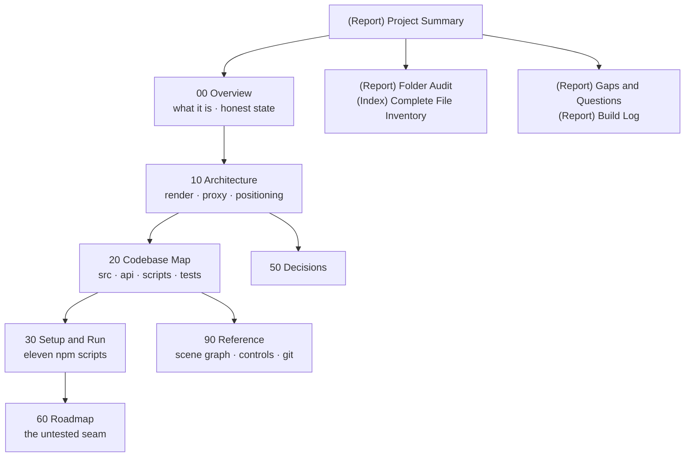

# Master Map — 3D GitHub Visualizer

The whole vault on one page. Up one level: [[(Guide) BRUNO HQ]].

## The outline

- **00 Overview** — [[(Index) 00 Overview]]
  [[(Note) What the Visualizer Is]] · [[(Note) Honest State]]
- **10 Architecture** — [[(Index) 10 Architecture]]
  [[(Note) The Render Pipeline]] · [[(Note) The GitHub Proxy]] · [[(Note) Positioning and the Empty State]]
- **20 Codebase Map** — [[(Index) 20 Codebase Map]]
  [[(Note) Source Map]] · [[(Note) Scripts and Harnesses]]
- **30 Setup & Run** — [[(Index) 30 Setup and Run]]
  [[(Note) Install Run and Test]] · [[(Note) Deploy and Environment]]
- **50 Decisions** — [[(Index) 50 Decisions]]
  [[(Note) Key Decisions]]
- **60 Roadmap, Tasks & Ideas** — [[(Index) 60 Roadmap Tasks and Ideas]]
  [[(Note) Roadmap and Open Work]]
- **90 Reference** — [[(Index) 90 Reference]]
  [[(Note) Scene Graph Interchange]] · [[(Note) Git History]]

**Vault plumbing:** [[(System) Flint Init]] · [[(Report) Project Summary]] ·
[[(Report) Folder Audit]] · [[(Index) Complete File Inventory]] ·
[[(Report) Gaps & Questions]] · [[(Report) Build Log]] · [[(Index) Sources]] ·
[[(Index) Media]] · [[(Note) Exports]]

## Start here if you want to…

| Want to | Read |
|---|---|
| Know in one page what this is | [[(Report) Project Summary]] |
| Run it locally | [[(Note) Install Run and Test]] |
| Understand why it is 3 draw calls | [[(Note) The Render Pipeline]] |
| Understand why the empty state is the product | [[(Note) Positioning and the Empty State]] |
| Touch anything near the GitHub token | ⚠️ [[(Note) The GitHub Proxy]] first |
| Feed it data that is not a GitHub profile | [[(Note) Scene Graph Interchange]] |
| Know what is unproven | [[(Note) Honest State]] · [[(Report) Gaps & Questions]] |
| Find which file does a thing | [[(Note) Source Map]] |
| Reproduce a published number | [[(Note) Scripts and Harnesses]] |
| See every file in the repo | [[(Index) Complete File Inventory]] |
