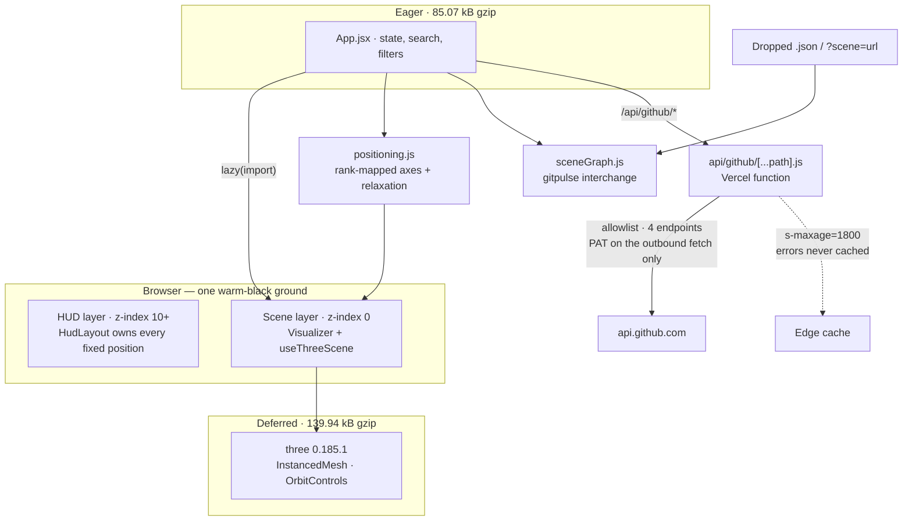

# 10 Architecture

| Note | Covers |
|---|---|
| [[(Note) The Render Pipeline]] | one `InstancedMesh`, the label atlas, the HUD layering, the bundle split |
| [[(Note) The GitHub Proxy]] | ⚠️ the allowlist, the token, the edge cache and rate limit |
| [[(Note) Positioning and the Empty State]] | rank mapping, relaxation, and the seeded galaxy |

Up: [[(Map) Master Map]]
