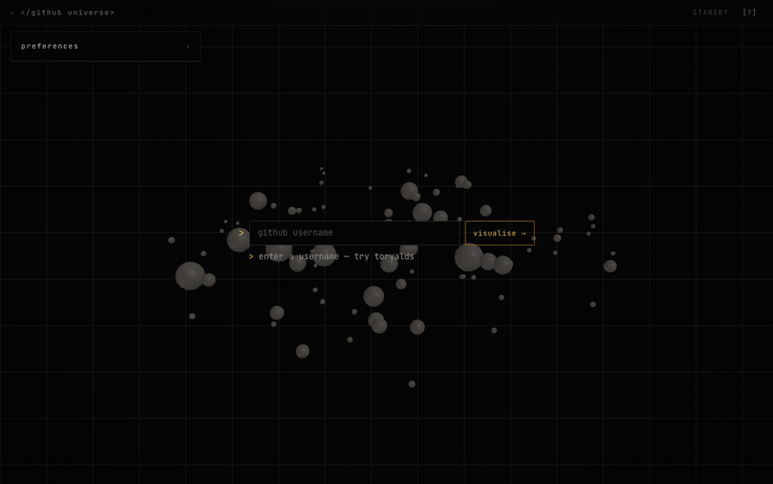
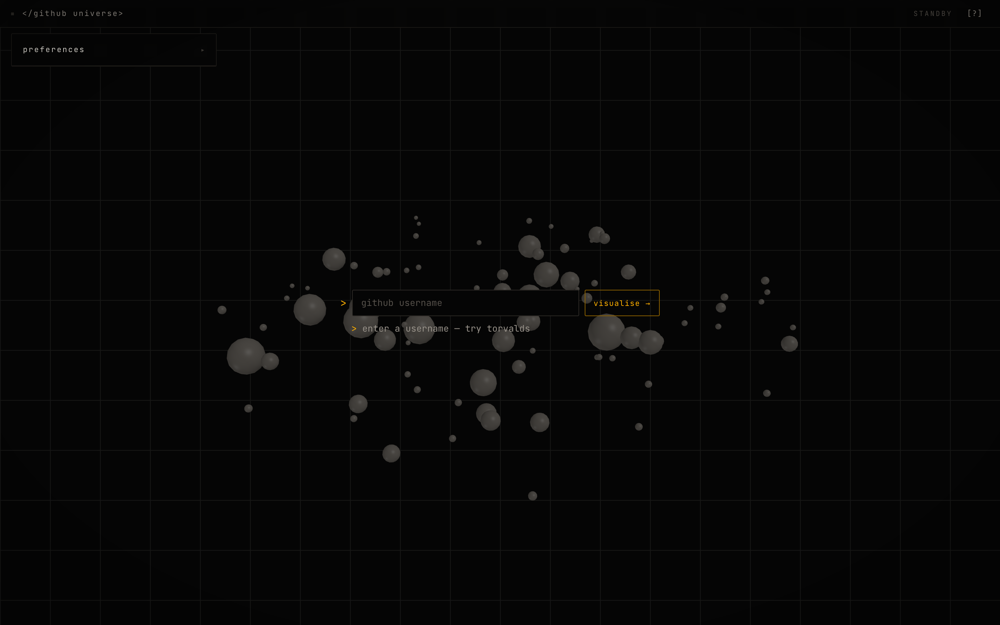
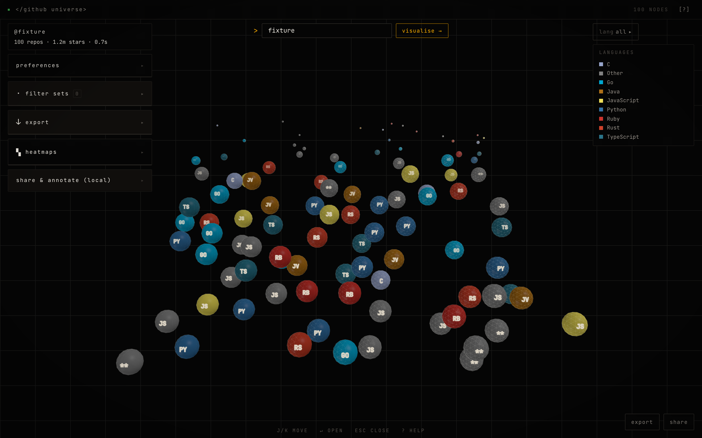

# 3D GitHub Visualizer

Any GitHub profile rendered as a 3D universe. Each repository becomes an icosahedron sphere — sized by stars, coloured by language, positioned by age, star count and fork activity.

**Live demo:** `[PLACEHOLDER — live URL]`



*Recorded from the running app. The profile is a deterministic fixture, not a real account — so the asset stays reproducible and does not put someone else's repository names in this README.*

> **Status:** not yet deployed. The app currently calls the GitHub REST API directly from the browser with no token, so it shares the 60 req/hour unauthenticated per-IP limit. A server-side token proxy lands before deployment — see [Roadmap](#roadmap).

| | |
|---|---|
|  |  |
| **Cold load.** No API call, no rate limit — a seeded ambient galaxy so the first ten seconds are never blank. | **A loaded profile.** Size ∝ √stars, colour by language, position by age / stars / forks. |

---

## Features

Everything listed here is implemented in `src/`. Nothing is listed that the code does not do.

### Core visualisation
- **Node rendering** — each repo is a geodesic icosahedron with a hairline wireframe shell and a billboarded monospace language code (`JS`, `PY`, `RS`, …)
- **Dynamic sizing** — `size = clamp(√stars / 12, 0.35, 3.2)` (`src/utils/positioning.js`)
- **Language colours** — 17 language-specific colours, grey fallback for the rest (`src/utils/colors.js`)
- **3-axis positioning** — X = repo age, Y = stars, Z = fork count, each mapped by **rank** rather than linearly, because stars and forks are power-law distributed and a linear map collapses almost every repo onto the same coordinate. A deterministic relaxation pass then separates any nodes that still overlap.
- **Auto-rotation** — orbital camera with damping via `OrbitControls`

### Interaction
- **Click to explore** — repository detail panel with a README preview (first 500 characters)
- **Hover readout** — a fixed HUD slot (not a tooltip chasing the cursor), plus a ring around the node; the ring is green only when the repo was pushed within 30 days
- **Keyboard** — `Tab` / `Shift+Tab` cycle repos, `+` / `-` zoom, `?` or `/` opens help, `Escape` closes
- **Touch** — pinch to zoom, drag to orbit, tap to select
- **Entrance animation** — nodes grow at their final coordinates, largest first, 25 ms apart
- **Ambient galaxy** — a seeded 88-node placeholder field renders on cold load with no API call, so the empty state is never blank

### Search and filtering
- **GitHub username search** — up to 300 repos (3 pages of 100)
- **Username autocomplete** — top 5 matches from GitHub's user search API, cached in memory for 5 minutes
- **Language filter** — isolate repos by language
- **Custom filter sets** — save, load, import and export named filter combinations
- **Preference filters** — minimum stars, exclude archived, exclude forks

### Data and export
- **JSON export** — full or minimal repository data
- **CSV export** — selectable columns
- **Canvas screenshot** — PNG of the current view
- **Shareable URLs** — base64-encoded view state in a URL parameter
- **Named snapshots** — save and restore view states to `localStorage`

### Analytics
- **Heatmaps** — activity, contribution, language distribution, maturity and growth views
- **Stats display** — repo count with loading feedback
- **Colour legend** — language-to-colour reference

### Share & Annotate (local)
Local-only. There is no server and no real-time sync — state is shared by copying a URL, and annotations live in this browser's `localStorage`.

- **Repo annotations** — timestamped comments on any repository, stored locally
- **Snapshot sharing** — encode a view state into a shareable link
- **Import / export** — portable JSON of your local annotations and snapshots

### UX and accessibility
- **One theme** — a warm-black instrument palette (SIGNAL). There is deliberately no light theme and no toggle.
- **Responsive** — verified at 1440×900 and 390×844; the control rail becomes a bottom sheet on small screens
- **Focus-trapped dialogs** — `aria-modal`, Tab trapped inside, focus restored on close (`RepoDetails.jsx`, `KeyboardHelpModal.jsx`)
- **Screen reader support** — `aria-live` region for load state, skip link, ARIA roles
- **Loading phases** — three-stage progress (fetching repos → loading READMEs → building scene)
- **Keyboard help** — press `?`
- **Keyboard navigation** — `j`/`k` move between control modules, `↵` opens one

### Performance
Measured, not asserted. Raw numbers in [`docs/perf.json`](docs/perf.json), produced by `npm run perf`.

| Repositories | Frame work (median) | Frame work (p95) | Draw calls |
|---|---|---|---|
| 100 | 0.1 ms | 0.2 ms | 3 |
| 250 | 0.2 ms | 0.2 ms | 3 |

Measured on an **Apple M4 Pro** at 1440×900 in a GPU-backed Chromium window, 240 samples per run.

"Frame work" is the time spent inside the render loop. It is quoted instead of frames-per-second because on this hardware the frame *interval* is pinned by the display, so an fps figure would measure the monitor rather than the app. A 60 fps budget is 16.7 ms per frame; this uses **0.2 ms of it at 250 repositories**, so frame rate is not the limiting factor on this machine.

`docs/perf.json` also records a software-rasteriser run (headless Chromium, no GPU, SwiftShader) at ~53–62 ms per frame. That is a floor for a machine with no GPU acceleration at all, not a desktop figure.

**Techniques**
- **One `InstancedMesh` for every repository** — draw calls stay constant as repository count grows, instead of one draw call and one cloned material per repo
- **LOD scaling** — icosahedron detail `3` under 50 repos, `2` from 50–150, `1` above 150
- **Render loop pauses when the tab is hidden** — verified by a frame counter that stops advancing
- **Idle slowdown** — drift halves after 60 s without input
- **Shadow maps disabled** — nothing in the scene casts or receives shadows
- **Debounced raycasting** — 40 ms debounce on hover detection
- **localStorage response cache** — 30-minute TTL

---

## Tech stack

| Layer | Technology | Version |
|---|---|---|
| UI framework | React | 18.2 |
| Build tool | Vite | 5.0 (builds as 5.4.21) |
| 3D engine | Three.js | 0.185.1 |
| Camera controls | `three/addons/controls/OrbitControls` | — |
| HTTP client | Axios | 1.6 |
| Styling | CSS custom properties | — |
| Persistence | `localStorage` | — |
| API | GitHub REST API v3 | — |

---

## Quick start

Requires Node.js 18+.

```bash
git clone https://github.com/br9704/github-3d-visualizer.git
cd github-3d-visualizer
npm install
npm run dev
```

Open <http://localhost:5173>.

```bash
npm run build      # production build to dist/
npm run preview    # serve the production build locally
```

**Note on rate limits:** unauthenticated GitHub API requests are limited to 60 per hour per IP address, shared across everyone behind that IP. A few searches can exhaust it. This is the problem the token proxy on the roadmap solves.

---

## Project structure

```
src/
├── main.jsx                          # React entry point
├── App.jsx                           # Root component, global state
├── App.css                           # Global styles, CSS custom properties
│
├── components/
│   ├── Visualizer.jsx                # Three.js scene, render loop, interaction
│   ├── SearchBar.jsx                 # Username search input
│   ├── UsernameAutocomplete.jsx      # GitHub user suggestions
│   ├── RepoDetails.jsx               # Repository dialog (focus-trapped)
│   ├── ColorLegend.jsx               # Language colour reference
│   ├── StatsDisplay.jsx              # Load state and repo count
│   ├── LanguageFilter.jsx            # Language filter
│   ├── Header.jsx                    # Instrument bar and status readout
│   ├── HudLayout.jsx                 # Owns every fixed position in the app
│   ├── KeyboardHelpModal.jsx         # Shortcut reference
│   ├── Pagination.jsx                # Load more repositories
│   ├── ExportShare.jsx               # Quick export and share controls
│   ├── FilterSetsManager.jsx         # Save and load filter combinations
│   ├── DataExportPanel.jsx           # JSON / CSV / screenshot export
│   ├── AdvancedHeatmaps.jsx          # Heatmap panels
│   ├── UserPreferencesPanel.jsx      # Settings panel
│   └── CollaborationPanel.jsx        # Share & annotate (local) panel
│
├── hooks/
│   └── useThreeScene.js              # Scene, camera and renderer lifecycle
│
├── services/
│   ├── userPreferences.js            # Persistent settings
│   ├── collaborationService.js       # Local sharing, snapshots, comments
│   ├── dataExporter.js               # JSON / CSV / screenshot logic
│   ├── filterSetsManager.js          # Filter set CRUD
│   └── heatmapGenerator.js           # Heatmap data generation
│
├── utils/
│   ├── githubApi.js                  # GitHub REST calls and caching
│   ├── positioning.js                # 3D coordinate calculation
│   └── colors.js                     # Language → colour mapping
│
└── styles/
    ├── signal.css                    # The design system: palette, type, motion
    ├── HudLayout.css                 # Regions, and the only file that positions chrome
    └── …                             # Per-component CSS
```

Outside `src/`:

```
scripts/
├── guards.mjs                        # 10 design-system and honesty checks (npm run guards)
├── shots.mjs                         # Real-browser screenshots, GitHub mocked (npm run shots)
└── histcmp.mjs                       # Rotation-tolerant screenshot comparison
tests/fixtures/github.mjs             # Deterministic GitHub fixtures
```

---

## Controls

| Input | Action |
|---|---|
| Left click + drag | Orbit |
| Scroll wheel | Zoom |
| Right click + drag | Pan |
| Click a sphere | Open repository details |
| Hover a sphere | Show tooltip |
| `Tab` / `Shift+Tab` | Cycle through repositories |
| `+` / `-` | Zoom |
| `j` / `k` | Move between control modules |
| `↵` | Open the focused module |
| `?` or `/` | Keyboard help |
| `Escape` | Close dialog |

---

## Measured build output

From `npm run build` on 2026-08-14 (Vite 5.4.21, terser, Three.js 0.185.1):

| Asset | Raw | Gzip |
|---|---|---|
| `dist/assets/index-*.js` | 796.74 kB | 212.10 kB |
| `dist/assets/index-*.css` | 64.24 kB | 12.24 kB |
| `dist/index.html` | 0.47 kB | 0.30 kB |

Vite warns that the JS chunk exceeds its 500 kB threshold — Three.js is not code-split yet. See [Roadmap](#roadmap).

---

## Roadmap

Tracked in [`masterplan.md`](masterplan.md).

- Designed landing and empty state — today the app renders nothing until a search succeeds
- Server-side GitHub token proxy, so the public demo is not limited to 60 req/hour
- Deployment, and a live URL at the top of this file
- Real screenshots and a recording of the entrance sequence
- A test suite and CI — **there are currently no tests in this repository**
- Three.js code-splitting to get the initial chunk under 500 kB

---

## Example profiles to try

- `torvalds` — Linux creator
- `gvanrossum` — Python creator
- `octocat` — GitHub's example account
- `facebook` — large organisation

---

## Contributing

1. Fork and branch: `git checkout -b feat/my-feature`
2. Develop: `npm run dev`
3. Verify the build: `npm run build`
4. Open a pull request

Commit prefixes: `feat:` `fix:` `perf:` `a11y:` `ux:` `docs:` `chore:`

---

## License

[MIT](LICENSE) © 2026 Bruno Jaamaa

---

## Author

Bruno Jaamaa — Bachelor of Design in Computing and UX Design, University of Melbourne.
