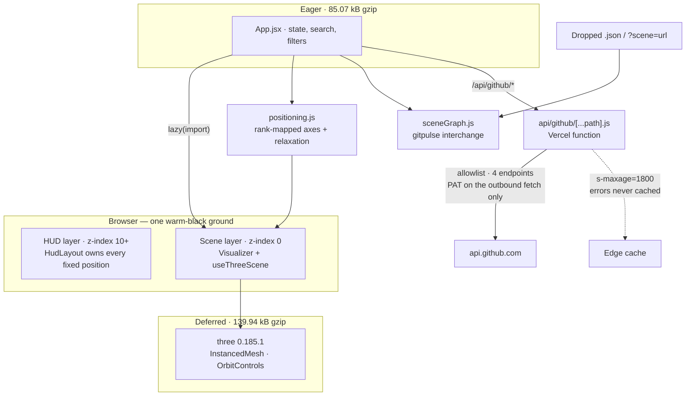

# 3D GitHub Visualizer

Any GitHub profile rendered as a navigable 3D universe — one instanced draw call per frame, and a scene that is already moving before you type anything.


*Recorded from the running app. The profile is a deterministic fixture, not a real account, so the asset stays reproducible and does not put someone else's repository names in this README.*

```bash
git clone https://github.com/br9704/github-3d-visualizer.git
cd github-3d-visualizer && npm install && npm run dev
```

> **Live: https://github-3d-visualizer.vercel.app**
>
> Deployed on Vercel with the token proxy authenticated against real GitHub: `x-ratelimit-remaining` reads in the 4,900s rather than under 60, so the demo runs on 5,000 requests/hour instead of the shared unauthenticated limit. Edge caching observed in production (`x-vercel-cache: HIT`), and the proxy allowlist verified live — `/api/github/user` returns 403 with a real token behind it. The token appears in none of the four client chunks. Pushes to `main` deploy automatically.

Case study: [brunojaamaa.dev/projects/3d-github-visualizer](https://brunojaamaa.dev/projects/3d-github-visualizer)

| | Measured | Source |
|---|---|---|
| Eager JS payload | **223.81 → 85.07 kB gzip** (62% cut) | `npm run build` · guard #11 |
| First drawn frame, 4G | **529 ms** | [`docs/firstpaint.json`](docs/firstpaint.json) |
| Frame work, p95 at 250 repos | **0.2 ms** of a 16.7 ms budget | [`docs/perf.json`](docs/perf.json) |
| Draw calls | **3**, constant in repository count | [`docs/perf.json`](docs/perf.json) |
| Tests · guards · browser checks | **74 · 11 · 15** | [`tests/`](tests) · [`scripts/`](scripts) |

[](https://github.com/br9704/github-3d-visualizer/actions/workflows/ci.yml)
[](LICENSE)

| | |
|---|---|
|  |  |
| **Cold load.** No API call, no rate limit — a seeded 88-node ambient galaxy, so the first ten seconds are never blank. | **A loaded profile.** Size ∝ √stars, colour by language, position by age / stars / forks. |

---

## What it does

You give it a GitHub username and it builds a universe out of that profile. Every repository becomes a geodesic icosahedron: its radius scales with the square root of its star count, its colour comes from its primary language, and its position encodes three axes at once — age on X, stars on Y, forks on Z. A hairline wireframe shell shows the facet structure, and each node carries a billboarded monospace language code (`JS`, `PY`, `RS`, `C++`) rather than an icon. You orbit it, hover it, click into a repository, filter by language, and export what you are looking at as JSON, CSV, a PNG, or a shareable URL.

The distinctive problem was not rendering the spheres — it was the empty state. A visitor who never types a username is the majority case, and this app used to show them a blank white page. So the empty state is the product: on cold load, before any network request, a seeded procedural generator streams 88 uncoloured placeholder spheres into a drifting galaxy. It works offline, it can never rate-limit, and it dims to 25% on your first keystroke before dissolving as real data arrives. The scenery is deliberately uncoloured, because language colour carries meaning here and decoration must not borrow it.

Positioning turned out to be the hard part. Stars and forks are power-law distributed — one repository with 60,000 stars and ninety under fifty is the normal shape of a profile — so a linear min-max map collapses almost every node onto the same coordinate and renders the universe as one overlapping mass with a couple of outliers stranded far away. Axes are mapped by **rank** instead, which is distribution-free, followed by a deterministic relaxation pass that separates anything still closer than the sum of its radii.

The whole scene is one `InstancedMesh`, so draw calls stay constant as repository count grows: **3 for the entire scene at 250 repositories**, covering nodes, wireframe shells and the full label set. The labels live in a single canvas atlas drawn as one instanced quad and billboarded in the vertex shader, so there is no per-frame CPU work for them at all.

---

## Architecture



Two decisions carried the design.

**The proxy is an allowlist, not a passthrough.** Four endpoint patterns are proxied; everything else returns 403 and never reaches GitHub. Without that, `/api/github/<anything>` would be an open proxy authenticating with our token — including `/user`, which would reveal whose token it is. Query parameters are bounded and allowlisted too, so `per_page=9999` clamps to 100 and an unknown `client_secret` is dropped rather than forwarded. There is one code path, not a production-only branch: `vite.config.js` proxies the same `/api/github` route to GitHub unauthenticated in dev and preview, so the deployed path is the one local development exercises.

**Layout is optional in the scene-graph format, but all-or-nothing.** A producer that only knows about repositories should not have to invent 3D coordinates — omit `position` and `size` and this app computes them. A producer that has a layout it cares about can pin it. It is honoured only if *every* node carries it, because half a layout would put some nodes at meaningful coordinates and the rest at the origin, which renders as a bug rather than as data.

---

## How it was built

This repository was audited in August 2026 and the audit is the reason it looks the way it does now. `npm run build` exited 0, transformed 404 modules, produced no console errors — **and the app rendered a near-blank white page**. A build-level check had been passing for months against something no visitor could use. That is the rule this project exists to teach: *"it builds" is not "it works."*

The causes were all presentation, and none of them was visible to a compiler. The canvas mounted `position: fixed; inset: 0` with no `z-index`, so it painted over the header — the header was never missing, it was covered. The renderer was created with `alpha: true` while the theme context defaulted to `prefers-color-scheme: light`, so the page background showed through the canvas as white. Eleven components each declared `position: fixed` independently, which is why one preferences panel appeared to float detached in a corner. Fourteen of fifteen components used emoji as controls. And the geometry was built at radius `size` *and* scaled by `size`, so a sphere's rendered radius was `size²` — a 0.3 repository shrank to 0.09 and vanished, a 4.0 one ballooned to 16 and swallowed the scene.

**The verification itself was broken, which mattered more than any single bug.** Headless Chromium has no WebGL: `canvas.getContext('webgl2')` returns `null`, so every automated check ever run against this project had been screenshotting an empty canvas and passing. Two further gates were later found measuring nothing — a WebGL canvas cannot be read back with `drawImage` without `preserveDrawingBuffer`, so the first version of the motion checks measured zero every time; and the browser suite hardcoded a port and started no server of its own, so on a machine where another project held that port it ran end-to-end **against a different application** and scored that application's page as a rendered scene. Every green "cold load renders a scene within 2s" recorded before Sprint 10 was measured on unthrottled localhost, which no visitor has.

Measurement changed the code more than once. A frame-*interval* figure turned out to be useless on fast hardware — 100 and 250 repositories both reported an identical 4.2 ms, which is the display refresh rather than the app — so the harness now records time spent *inside* the render loop instead. And splitting Three.js into its own chunk, which is the obvious optimisation, was a **regression** until it was measured: a dynamic import is not requested until the chunk containing the import statement has downloaded, parsed and run, so the largest asset queued behind the two smallest ones and cost 944 ms to first frame on Fast 3G. The fix is a build-time `modulepreload`, and it exists because the number was checked rather than assumed.

Ten test reports claiming comprehensive coverage were deleted, along with 27 other process documents, because there were zero tests behind them. The suite that replaced them found three bugs on its first run — most tellingly that `"C++".toLowerCase()` is `c++` while the colour map's key is `cpp`, so C++ and C# repositories were falling through to the grey "Other" bucket. A grey sphere among grey spheres reads as data, not as a bug, which is exactly why nobody had ever noticed.

The full record — every sprint, every as-shipped delta, every deferral with its reason — is in [`masterplan.md`](masterplan.md).

---

## Results

### Bundle

Three.js is code-split out of the critical path and advertised to the browser with a `modulepreload`, so it downloads beside the app rather than behind it.

| | Before | After |
|---|---|---|
| Eager JS (blocking first paint) | 834.06 kB / 223.81 kB gzip | **270.74 kB / 85.07 kB gzip** |
| Total JS shipped | 834.06 kB / 223.81 kB gzip | 835.72 kB / 225.01 kB gzip |

**Total JS did not go down** — it rose slightly, mostly from the Three.js 0.159 → 0.185.1 upgrade. The win is entirely on the critical path. Vite still prints its 500 kB chunk-size warning for `three` at 545.56 kB, deliberately: tree-shaking already removes 27% of the library (its own full minified build is 750.94 kB), and what remains is `WebGLRenderer` and the shader library. Raising `chunkSizeWarningLimit` to silence it would mute a real regression detector, so instead guard #11 asserts the *blocking* graph — the entry chunk plus its transitive static imports — stays under 500 kB with `three` absent from it.

### First drawn frame

Time from navigation to the first frame the renderer draws, cold cache, 9 samples per profile — [`docs/firstpaint.json`](docs/firstpaint.json), reproduce with `npm run firstpaint`.

| Link | One chunk | Split, no preload | **Shipped** |
|---|---|---|---|
| localhost | 139 ms | 178 ms | 250 ms |
| 4G — 9 Mbit/s, 40 ms RTT | 438 ms | 527 ms | **529 ms** |
| Fast 3G — 1.6 Mbit/s, 563 ms RTT | 2549 ms | 3493 ms | **2665 ms** |

**On Fast 3G this misses its own 2 s target**, and so does the unsplit build — that is a property of shipping a WebGL renderer, not something the split introduced. The gate runs on 4G, because a bar nothing can clear is not a bar. The localhost row is the noisiest measurement here (single-sample outliers of 1.2–1.8 s) and is the profile where preloading plausibly costs something real, since bandwidth was never the constraint there.

### Frame work

| Repositories | Frame work (median) | Frame work (p95) | Draw calls |
|---|---|---|---|
| 100 | 0.1 ms | 0.2 ms | 3 |
| 250 | 0.2 ms | 0.2 ms | 3 |

Measured on an **Apple M4 Pro** at 1440×900 in a GPU-backed Chromium window, 240 samples per run, on 2026-08-14.

"Frame work" is time spent inside the render loop. It is quoted instead of frames-per-second because on this hardware the frame *interval* is pinned by the display, so an fps figure would measure the monitor rather than the app. A 60 fps budget is 16.7 ms per frame; this uses 0.2 ms of it at 250 repositories. [`docs/perf.json`](docs/perf.json) also records a software-rasteriser run (headless Chromium, no GPU, SwiftShader) at 72–78 ms per frame — a floor for a machine with no GPU acceleration at all, not a desktop figure.

### Verification

```
$ npm test
 Test Files  5 passed (5)
      Tests  74 passed (74)

$ npm run guards
PASS — all guards green
note: blocking JS 270.74 kB of the 500 kB budget (2 chunk(s))

$ npm run motion-check
PASS — 15/15 MOTION.md checks green
```

| Suite | Tests | Covers |
|---|---|---|
| [`tests/proxy.test.mjs`](tests/proxy.test.mjs) | 13 | allowlist, token handling, cache split, rate-limit passthrough |
| [`tests/sceneGraph.test.mjs`](tests/sceneGraph.test.mjs) | 14 | the interchange contract, lossless round trip |
| [`tests/positioning.test.mjs`](tests/positioning.test.mjs) | 10 | axis spread on power-law data, separation, determinism |
| [`tests/scene.test.mjs`](tests/scene.test.mjs) | 22 | language colours and codes, easing, seeded galaxy, liveness |
| [`tests/dom/services.test.mjs`](tests/dom/services.test.mjs) | 15 | annotations, snapshots, preferences under jsdom |

The 11 guards are mechanical design-system and honesty checks — no emoji in `src/`, no light theme, palette-only colours in CSS (hex *and* `rgb()`), only `HudLayout` positions chrome, every `var(--x)` defined, every README image present, a CI badge that points at a workflow which actually runs the suite, no token literal, and the blocking-payload budget. Nothing in the suite touches the network: GitHub is mocked from `tests/fixtures/github.mjs`, so a run can never be broken by the rate limit.

---

## Usage

Requires Node.js 18+.

```bash
npm run dev        # development server on :5173
npm run build      # production build to dist/
npm run preview    # serve the production build

npm test           # 74 unit tests (Vitest)
npm run guards     # 11 design-system and honesty checks
npm run shots      # real browser, both viewports, GitHub mocked
npm run motion-check   # the MOTION.md acceptance list
npm run perf       # frame-time measurement -> docs/perf.json
npm run firstpaint # throttled time-to-first-frame -> docs/firstpaint.json
```

`npm run dev` and `npm run preview` proxy `/api/github` straight to GitHub *without* a token, so local development shares the 60 requests/hour unauthenticated per-IP limit and a few searches can exhaust it. The deployed build routes the same path through the serverless function, which authenticates and caches.

### Scene graph interchange

The visualiser reads a portable scene-graph format, so a profile is not the only way to fill it — drop a `.json` file anywhere on the page, or open `?scene=<url>`.

```jsonc
{
  "format": "github-3d-visualizer/scene",
  "version": 1,
  "subject": { "login": "torvalds" },
  "nodes": [
    {
      "id": "torvalds/linux",   // required, unique
      "label": "linux",         // required
      "language": "C",
      "stars": 190000,
      "forks": 55000,
      "createdAt": "2011-09-04T22:19:36Z",
      "position": { "x": 12.4, "y": -3.1, "z": 8.8 },  // optional
      "size": 3.2                                      // optional
    }
  ]
}
```

A reader refuses an unknown `version` rather than guessing, and reports every validation problem at once rather than one at a time. Reference file: [`docs/example-scene.json`](docs/example-scene.json).

### Controls

| Input | Action |
|---|---|
| Left click + drag | Orbit |
| Scroll wheel | Zoom |
| Right click + drag | Pan |
| Click a sphere | Open repository details |
| `Tab` / `Shift+Tab` | Cycle through repositories |
| `+` / `-` | Zoom |
| `j` / `k` | Move between control modules |
| `↵` | Open the focused module |
| `?` or `/` | Keyboard help |
| `Escape` | Close dialog |

---

## Limitations

- **Deployment routing is not covered by any test.** The proxy's 13 unit tests exercise the handler, and the bug that took the live proxy down for every real path was that the handler was never invoked. Nothing in CI would catch a repeat — the only thing that caught it was curling production.
- **On Fast 3G the first frame lands at 2665 ms**, missing this project's own 2 s bar. The unsplit build misses it too. Shipping a WebGL renderer over a 1.6 Mbit/s link costs what it costs.
- **The frame-time figures come from one machine.** An Apple M4 Pro is not representative hardware, and the only other number available is a software-rasteriser floor. There is no measurement on integrated graphics, which is what `MOTION.md` originally asked for.
- **"Share & Annotate" is local-only.** There is no server and no real-time sync — state is shared by copying a URL and annotations live in one browser's `localStorage`.
- **`prefers-reduced-motion` is honoured, but the app is inherently visual.** There is no non-3D fallback view; a visitor without WebGL gets a printed message rather than the data.
- **Commit history is authored by a bot.** 48 of the commits are attributed to `OpenClaw Bot` and `Claude Code`. Rewriting that is a force-push over public history and is owner-gated.
- **Three language aliases are inert.** `F#`, `Objective-C` and `Shell` map to keys with no colour defined, so they render in the grey "Other" bucket despite appearing in the alias table.

---

## Status

**Live.** The designed empty state, the instanced scene and interaction motion, the HUD architecture, the Three.js 0.185 upgrade, the scene-graph interchange format, 74 tests with CI, the bundle split — and the token proxy, now authenticated against real GitHub rather than only a mock. Eleven sprints, each closed against acceptance criteria with a screenshot rather than a green build.

Deploys are wired to this repository: `main` is the production branch, so a push releases and the repo can no longer quietly disagree with production about a file the proxy depends on.

Requests to `/api/github` are rate limited at the edge — 100 per 60 seconds per IP, denied for a minute past that — so a throttled request costs no function invocation at all.

**Owner-gated:** rewriting commit authorship, and nothing else. Tracked in [S11 of the masterplan](masterplan.md#s11--owner-gated-block-).

**Next:** a deployment-routing check. The one bug that took production down was invisible to all 74 tests, and it would still be invisible today.

---

## License

[MIT](LICENSE) © 2026 Bruno Jaamaa

## Author

Bruno Jaamaa — [brunojaamaa.dev](https://brunojaamaa.dev) · [@br9704](https://github.com/br9704)
